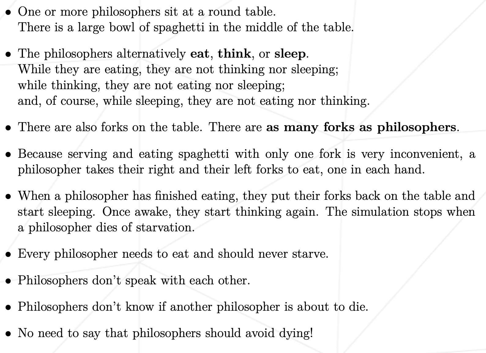
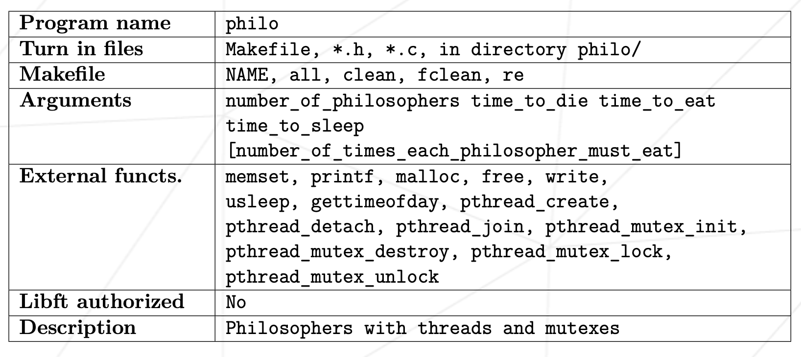

# Dining Philisophers

A project about multithreading, data races and deadlocks. 
The upgraded version of famous Edsger Dijkstra's task.


## What is a goal of project?

The goal is to write a console application, that accepts 5 arguments: 
1) Number of philosophers: The number of philosophers and also the number of forks.
2) Time to die (in milliseconds): If a philosopher didn’t start eating time_to_die milliseconds since the beginning of their last meal or the beginning of the simulation, they die.
3) Time to eat (in milliseconds): The time it takes for a philosopher to eat. During that time, they will need to hold two forks
4) Time to sleep (in milliseconds): The time a philosopher will spend sleeping. 
5) [optional] Number of times each philosopher must eat: If all philosophers have eaten at least number_of_times_each_philosopher_must_eat times, the simulation stops. If not specified, the simulation stops when a philosopher dies.

## Some details of task itself



## Specific rules of the project




## Compilation and launch

```bash
make
```

```bash
./philo arg1 arg2 arg3 arg4
```